# German Music Industry Ecosystem & Knowledge Graph Deep-Dive

> **Corpus**: AGIES Global Knowledge Graph (184 Nodes, 316 Relations)  
> **Focus**: Germany as a World-Leading Sonic Architecture, Electronic, Classical & Studio Hub

---

## 1. Germany's Structural Position in the Global Music Graph

Germany represents one of the most influential nodes in the global music industry, operating as the premier European crossroads for **electronic music production**, **techno and club culture**, **classical music heritage**, and **legendary analog/acoustic recording spaces**.

```mermaid
graph TD
    subgraph German Recording & Acoustic Heritage
        H[Hansa Studios Berlin]
        F[Funkhaus Berlin Saal 1]
        K[Kling Klang Düsseldorf]
        T[Teldex Studio Berlin]
        EB[Emil Berliner Studios]
    end

    subgraph German Record Labels & Institutions
        BMG[BMG Rights Management]
        DG[Deutsche Grammophon]
        KOM[Kompakt Cologne]
        OST[Ostgut Ton Berlin]
        INV[Innervisions Berlin]
        TRE[Tresor Records Berlin]
        ER[Erased Tapes]
    end

    subgraph German Pioneers & Masters
        KW[Kraftwerk]
        HZ[Hans Zimmer]
        NF[Nils Frahm]
        MR[Max Richter]
        RS[Rammstein]
        SCO[Scorpions]
        PVD[Paul van Dyk]
        SB[Stephan Bodzin]
        BB[Boris Brejcha]
        LVB[Ludwig van Beethoven]
        JSB[J.S. Bach]
    end

    subgraph International Bridges to Germany
        DB[David Bowie - Berlin Trilogy]
        DM[Depeche Mode]
        U2[U2 - Achtung Baby]
        BE[Brian Eno]
    end

    KW --> K
    DB --> H
    DM --> H
    U2 --> H
    BE --> H
    NF --> F
    NF --> ER
    HZ --> DG
    MR --> DG
    LVB --> T
    LVB --> DG
    JSB --> EB
    RS --> T
    SCO --> BMG
    SB --> KOM
    OST --> F
```

---

## 2. Key German Music Ecosystem Pillars

### A. Legendary German Studios & Sound Architecture
1. **Hansa Studios (Hansa Tonstudio, Berlin - "Hansa by the Wall")**:
   - The legendary studio where **David Bowie & Brian Eno** recorded the historic *Berlin Trilogy* (*Heroes*, *Low*), **Depeche Mode** created *Black Celebration* and *Some Great Reward*, **U2** recorded *Achtung Baby*, and **Nick Cave** forged *Your Funeral... My Trial*.
2. **Funkhaus Berlin (Nalepastraße / Saal 1)**:
   - Built in the 1950s as the GDR broadcasting center, it remains the world's largest acoustic recording complex with near-perfect reverberation. Home studio to **Nils Frahm** and modern classical luminaries.
3. **Kling Klang Studio (Düsseldorf)**:
   - The birthplace of electronic and synthesizer pop music, purpose-built by **Kraftwerk** (Ralf Hütter & Florian Schneider) to pioneer vocoders, drum machines, and electronic sequencing.
4. **Teldex Studio & Emil Berliner Studios (Berlin)**:
   - World benchmarks for orchestral acoustic recording and pure direct-to-disc analog mastering.

---

### B. German Electronic, Techno & Club Ecosystem
1. **Berlin Club & Underground Scene**:
   - Anchored by **Ostgut Ton** (Berghain resident label), **Tresor Records** (the historic Detroit-Berlin techno bridge), **Innervisions** (Dixon & Âme), and **Boysnoize Records**.
2. **Cologne Minimal Sound**:
   - **Kompakt Records** (Michael Mayer, Wolfgang Voigt), pioneering ambient techno and minimal microhouse.
3. **German Electronic Heavyweights**:
   - **Kraftwerk**: The foundational architects of all modern electronic music, synthpop, and hip-hop beats.
   - **Paul van Dyk**: Berlin-based trance and electronic pioneer.
   - **Stephan Bodzin & Boris Brejcha**: Leading the global melodic techno and high-tech minimal movements.

---

### C. Classical Heritage & Modern Post-Minimalism
1. **Classical Foundations**:
   - **Ludwig van Beethoven** (Bonn) & **Johann Sebastian Bach** (Leipzig) represent the immutable harmonic foundation of Western musical theory.
2. **Deutsche Grammophon (Berlin/Hamburg, founded 1898)**:
   - The oldest and most prestigious classical record label in the world, setting international recording standards for over 125 years.
3. **Cinematic & Post-Classical Maestros**:
   - **Hans Zimmer** (Frankfurt): The world's #1 film score composer (*Inception*, *Dune*, *Interstellar*, *The Lion King*).
   - **Max Richter** (Hameln): Post-minimalist giant (*Sleep*, *Recomposed: Vivaldi - The Four Seasons*).
   - **Nils Frahm**: Blending acoustic upright pianos with Roland Juno synthesizers.

---

## 3. Structural Graph Metrics for Germany

- **German Entity Nodes**: 32 (15 Artists, 8 Labels, 5 Studios, 4 Producers)
- **Hansa Studios Centrality**: Ranked among the **Top 5 Global Studios** in betweenness centrality, bridging Anglo-American rock/pop titans (Bowie, U2, Depeche Mode) with European avant-garde producers (Brian Eno, Conny Plank).
- **Deutsche Grammophon & BMG Market Gravity**: High in-degree clustering connecting both historic orchestral masterworks and modern electronic publishing.
